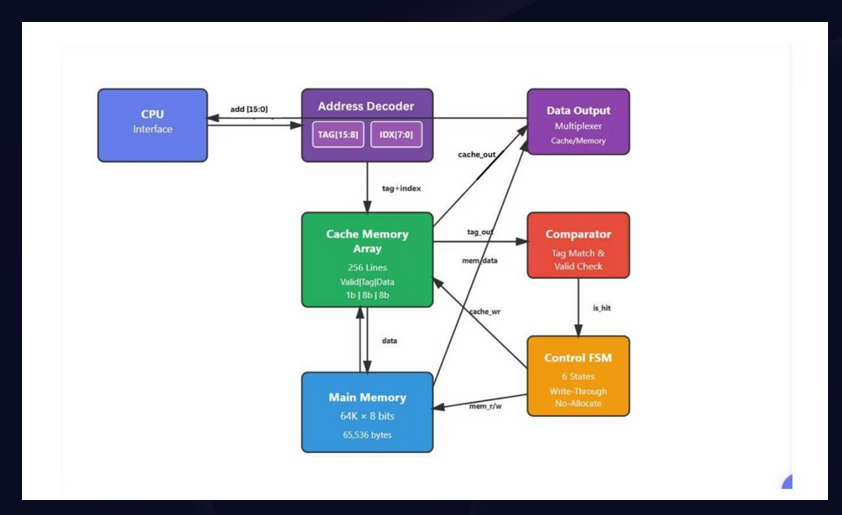
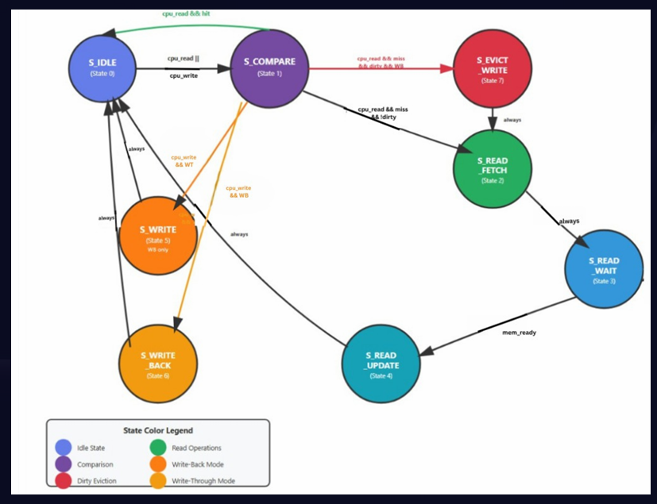
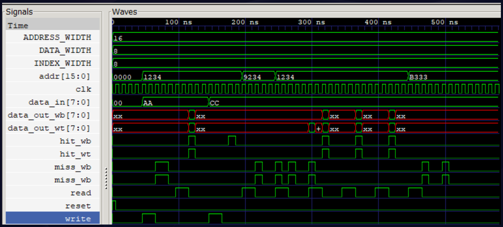

# Direct-Mapped Cache Memory (Verilog)


A parameterized **Direct-Mapped Cache Memory** implemented in **Verilog HDL**, supporting both **Write-Through** and **Write-Back** cache write policies. The design includes a finite state machine (FSM) based cache controller, tag comparison logic, dirty-bit management, and a comprehensive testbench for validating cache behavior under different access patterns.

---

## Features

- Configurable direct-mapped cache architecture
- Supports both **Write-Through** and **Write-Back** policies
- Dirty-bit handling for Write-Back cache
- Tag comparison with valid-bit verification
- FSM-based cache controller
- Parameterized cache size, address width, and data width
- Simulated main memory with ready/handshake signaling
- Comprehensive testbench covering cache hits, misses, conflicts, and evictions

---

## Project Structure

```
├── cache_memory.v          # Cache memory array (Tag, Data, Valid, Dirty bits)
├── comparator_logic.v      # Tag comparator and hit detection
├── control_logic_u.v       # Cache controller (FSM)
├── direct_mapped_cache_u.v # Top-level cache module
├── main_memory.v           # Main memory model
└── testbench_u.v           # Simulation testbench
```

---

## Design Components

The cache consists of the following modules:

### Cache Memory Array
- Stores cache data
- Stores tag bits
- Maintains valid bits
- Maintains dirty bits (Write-Back mode)

### Comparator Logic
- Compares CPU tag with cached tag
- Checks valid bit
- Generates cache hit/miss signal

### Control Logic (FSM)
Responsible for managing cache operations through multiple states including:

- Idle
- Tag comparison
- Memory fetch
- Cache update
- Write-through
- Write-back
- Dirty block eviction
- Memory wait states

### Main Memory
A simple synchronous memory model providing:

- Read operations
- Write operations
- Ready handshake signal

---

## Supported Write Policies

### Write-Through
- Cache and main memory are updated simultaneously.
- Uses a No-Write-Allocate policy on write misses.
- Simpler implementation with no dirty-bit dependency.

### Write-Back
- Updates only the cache on write hits.
- Uses dirty bits to track modified cache lines.
- Dirty blocks are written back to memory only during eviction.
- Uses Write-Allocate on write misses.

---

## Testbench Coverage

The provided testbench validates both cache policies using identical workloads.

Implemented test cases include:

- Write followed by read
- Cache hit verification
- Cache miss handling
- Conflict misses
- Cache line replacement
- Dirty block eviction
- Sequential cache hits
- Memory fetch operations

Both **Write-Through** and **Write-Back** implementations are instantiated simultaneously for behavior comparison.

---

## Parameterization

The design supports configurable parameters including:

| Parameter | Description |
|-----------|-------------|
| `ADDRESS_WIDTH` | CPU address width |
| `DATA_WIDTH` | Data word width |
| `INDEX_WIDTH` | Number of index bits |
| `CACHE_DEPTH` | Number of cache lines |
| `TAG_WIDTH` | Computed tag width |
| `WRITE_POLICY` | Selects Write-Through or Write-Back |

---

## Cache Architecture

The overall architecture of the direct-mapped cache, including the CPU interface, address decoder, cache memory array, comparator, control FSM, and main memory.

<p align="center">
  
</p>

---

## Cache Controller FSM

The cache controller is implemented as a finite state machine (FSM) that manages cache hits, misses, memory fetches, write-back operations, and cache updates for both Write-Through and Write-Back policies.

<p align="center">
  
</p>

---

## Simulation Results

The waveform below demonstrates cache read/write operations, cache hits and misses, and the behavior of both Write-Through and Write-Back cache implementations during simulation.

<p align="center">
  
</p>

## Running the Simulation

Compile all Verilog files using your preferred simulator.

Example using **Icarus Verilog**:

```bash
iverilog -o cache_sim \
cache_memory.v \
comparator_logic.v \
control_logic_u.v \
direct_mapped_cache_u.v \
main_memory.v \
testbench_u.v
```

Run the simulation:

```bash
vvp cache_sim
```

Generate waveform:

```bash
gtkwave cache_dual_wave.vcd
```